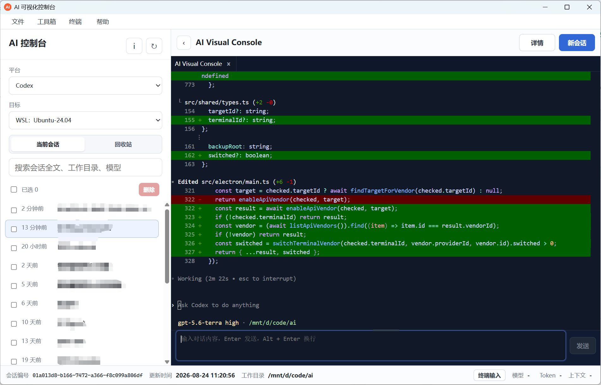
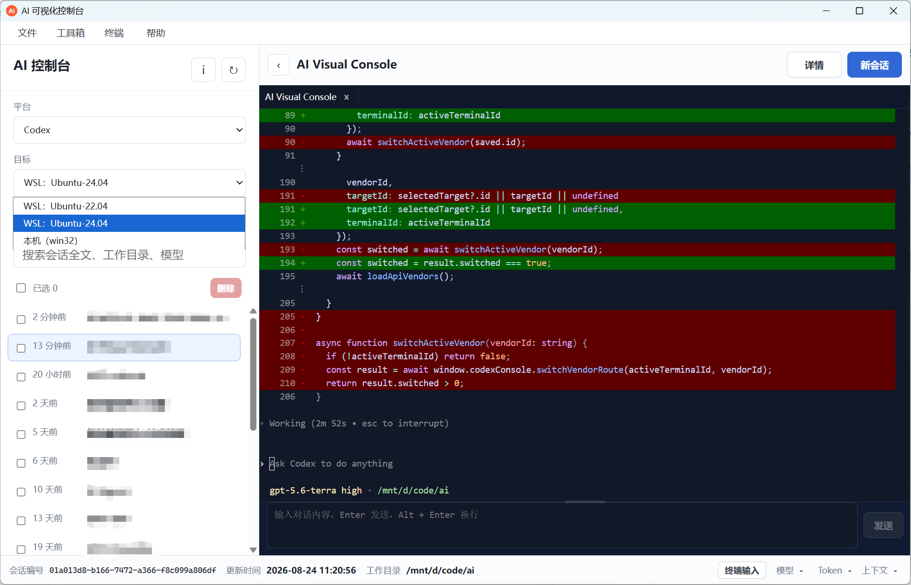
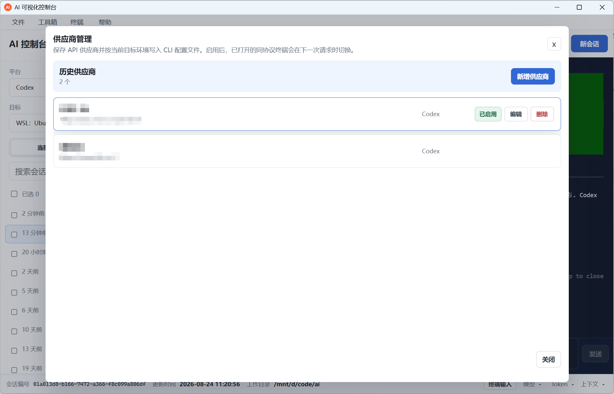
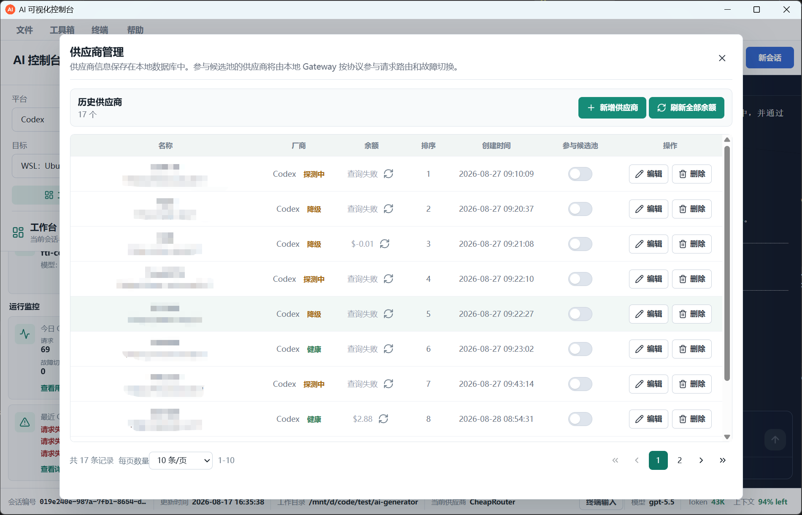
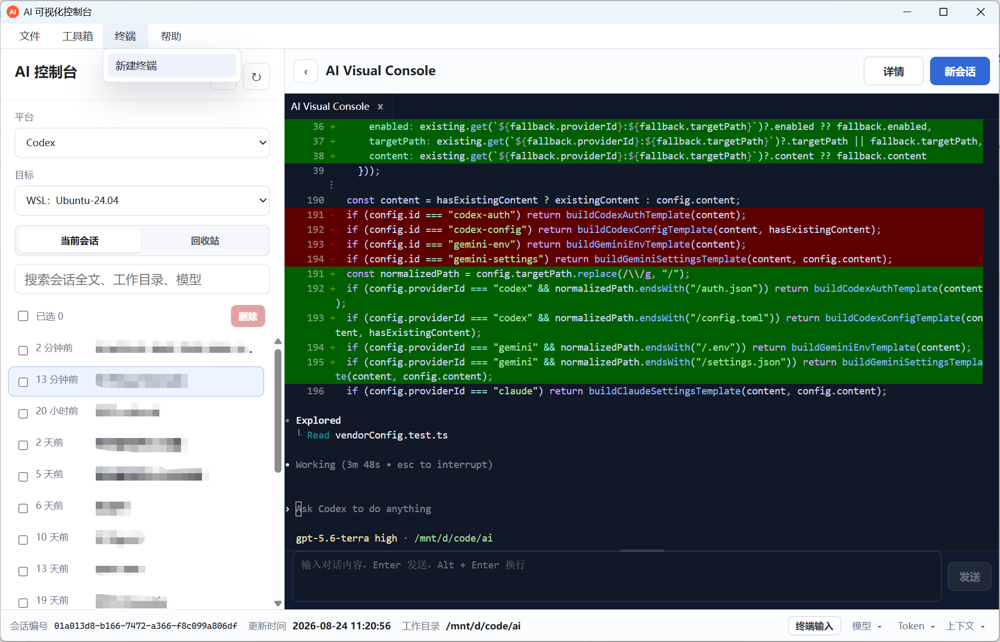
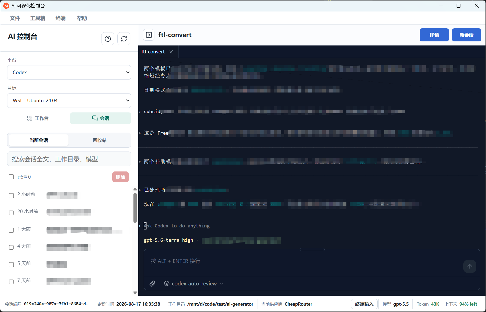

<div align="center">
  
  <h1>AI 可视化控制台</h1>
  <p>将多平台 AI CLI、会话资产、终端环境与本地路由，收束到一个连续的研发工作台。</p>
  <p><strong>Codex · Claude Code · Gemini · Qoder CN</strong></p>
  <p><a href="README.md">首页</a> · <a href="README_EN.md">English</a></p>
</div>

<p align="center">
  
</p>

## 为什么使用它

AI 可视化控制台是一款面向日常研发工作的跨平台 Electron 桌面应用。它不替代官方 CLI，而是围绕官方 CLI 建立统一工作台：在同一个界面中组织会话、切换运行环境、管理终端、配置供应商，并保留每个 CLI 原有的会话与交互方式。

当一个任务跨越多个项目、多个 WSL 发行版或多个 AI 平台时，工作不应被终端窗口、会话文件和供应商配置打散。AI 可视化控制台将这些要素变成可恢复、可检索、可管理的工程资产。

## 核心能力

### 多平台、多环境的统一工作台

- 统一接入 Codex、Claude Code、Gemini 和 Qoder CN。
- 支持本机、PowerShell、Git Bash 与多个 WSL 发行版。
- 平台、目标环境与终端窗口可以独立切换，避免一个操作影响正在进行的其他会话。
- 同时提供 AI 会话终端与系统终端，减少在不同工具间往返的成本。

### 把会话变成可管理的工程资产

- 历史列表基于轻量摘要快速加载，避免打开工作区时全量解析 JSONL。
- 详情页按需读取最新会话文件，并以分页方式加载大型会话内容。
- 支持继续会话、搜索、复制、分支、重命名、归档、恢复与永久删除。
- 从指定消息创建分支时保留正确的历史上下文，便于探索不同实现路径。

### 本地 Gateway 与供应商路由

- 供应商地址、API Key、排序、费率和候选池状态统一保存在本地 SQLite。
- 请求在边界处选择供应商；已发出的请求保持原路由，不会中途切换。
- 候选池按照排序参与故障转移；关闭、异常或熔断的供应商不会被继续选用。
- 候选池变更会在后续请求生效，无需关闭当前终端。
- 可配置 Gateway 监听端口、失败阈值与熔断持续时间。

### 面向效率的终端交互

- 自管输入支持模型选择、文件或文件夹附件，以及 `Alt + Enter` 多行输入。
- 终端提供搜索、复制、粘贴、右键菜单、尺寸适配与多标签体验。
- 支持从供应商 API 拉取模型，以及按供应商策略刷新余额。
- Codex Skill 支持导入、启用、禁用、归档、删除与恢复。

## 界面预览

| 多目标环境 | 供应商管理 |
| --- | --- |
|  |  |
| Skill 管理 | 系统终端 |
|  |  |
| 会话中的代码变更 | 会话工作区 |
|  |  |

## 快速开始

### 环境要求

- Windows、macOS 或 Linux
- Node.js 20 或更高版本
- pnpm 10.x
- 使用 WSL 时，至少需要一个可用的 WSL 发行版
- 使用某个平台前，请安装对应的官方 CLI；应用提供 CLI 安装入口

### 本地启动

```bash
pnpm install --frozen-lockfile
pnpm dev
```

首次启动后，在左侧选择平台和目标环境即可创建会话。应用会发现本机与 WSL 目标；目标不可用时，可在会话设置中补充路径和相关配置。

### 检查与构建

```bash
# 类型检查、代码规范和测试
pnpm typecheck
pnpm lint
pnpm test

# 构建应用
pnpm build

# 按平台生成安装包
pnpm dist:win
pnpm dist:mac
pnpm dist:linux
```

## 使用方式

### 开始或恢复会话

1. 在左侧选择平台和目标环境。
2. 点击“新会话”，或从历史列表恢复已有会话。
3. 在终端中继续工作；需要检查完整上下文时打开“详情”。
4. 在详情中搜索消息、查看 Token 信息，或从指定位置创建分支。

历史列表仅使用摘要和索引数据。完整内容在查看详情或恢复会话时才按需读取。Qoder CN 使用官方 `qodercn` CLI 和 `~/.qoder-cn` 会话目录，模型与认证仍由 Qoder CLI 自身管理。

### 配置供应商与本地路由

1. 打开“工具箱 → 供应商管理”。
2. 新增供应商，填写名称、API 地址、API Key、排序和可选费率。
3. 打开“参与候选池”，决定该供应商是否参与故障转移。
4. 在“文件 → 设置”中配置 Gateway 端口、失败阈值和熔断持续时间。

Gateway 仅在请求开始时决定路由。进行中的请求不会被改写；供应商状态或候选池发生变化后，下一次请求会读取最新配置。

### 使用 WSL

应用会自动发现 WSL 发行版，并在相应的 WSL 环境中调用 CLI 及会话目录。自动探测不到路径时，可在会话设置中指定 WSL 内路径，例如 Codex 的 `~/.codex`。

## 数据与安全

- 应用数据保存在运行目录的 `data/` 中；供应商、索引和设置由本地 SQLite 管理。
- API Key 仅供主进程的本地 Gateway 调用上游接口；会话正文仍由各官方 CLI 保存在自身 JSONL 文件中。
- 历史缓存只保存摘要、元数据和可重建索引，不保存完整会话详情正文。
- Gateway 默认监听 `127.0.0.1`，终端使用独立令牌访问本地路由。

## 技术栈

- Electron、React、TypeScript
- SQLite（WAL 模式）
- xterm.js 终端渲染
- 流式 JSONL 读取与详情分页
- 本地 Gateway、健康状态与故障转移

## 许可证

本项目使用 [MIT License](LICENSE) 授权。
